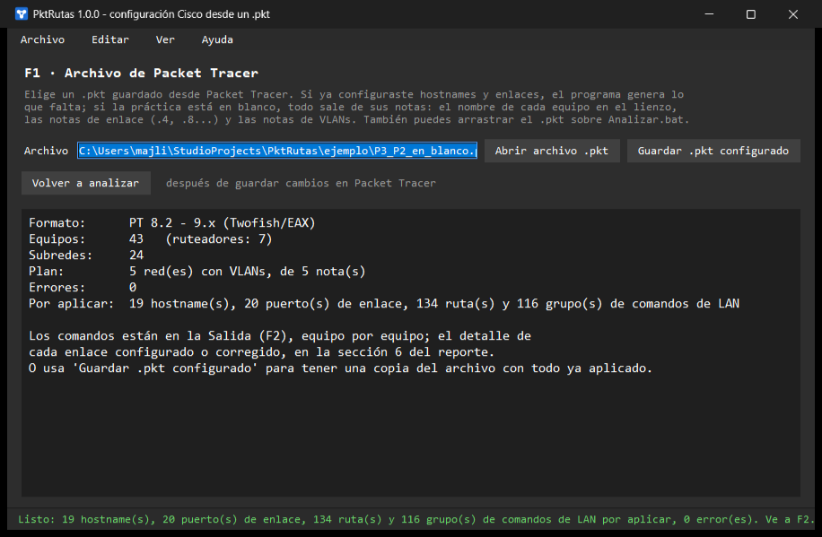
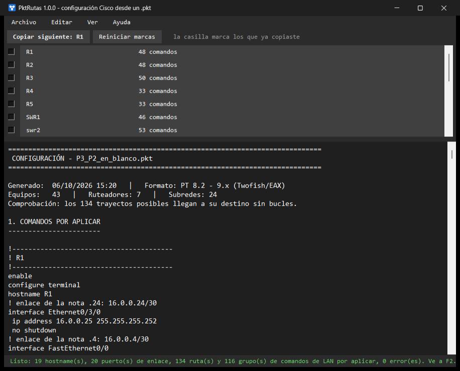

# PktRutas

Genera la configuración Cisco de tus prácticas de Packet Tracer. Lee el `.pkt`
y saca lo que le falta: hostnames, enlaces /30, ruteo estático, VLANs, SVI o
subinterfaces, DHCP, troncales, EtherChannel y la raíz de STP. Si la práctica
está en blanco, la configura completa con lo que pones en el lienzo: el nombre
de cada equipo, las notas de los enlaces y las notas con las redes y VLANs.

Puedes pegar los comandos equipo por equipo o guardar una copia del `.pkt` con
todo ya aplicado, lista para abrir en Packet Tracer (8.2 a 9.x).



## Instalación

Necesitas Windows y [Python 3.10 o más nuevo](https://www.python.org/downloads/),
instalado con las opciones que trae marcadas (incluyen tkinter, la ventana).

1. Descarga `PktRutas-1.0.0.zip` de
   [Releases](https://github.com/QuesitoOaxaca21/PktRutas/releases/latest).
2. Clic derecho sobre el zip → **Extraer todo**.
3. En la carpeta que sale, doble clic en **`Instalar.bat`**.

Queda en el menú Inicio, en el escritorio y en el menú **Enviar a**: clic
derecho sobre un `.pkt` → Enviar a → PktRutas lo abre ya analizado. Se instala
sólo para tu usuario, sin permisos de administrador. Para actualizar, corre el
`Instalar.bat` de la versión nueva; para quitarlo, **Configuración →
Aplicaciones → PktRutas → Desinstalar**.

Si prefieres no instalarlo, dentro de la carpeta descomprimida da doble clic en
`Analizar.bat` (o arrastra un `.pkt` encima).

> **¿Por qué un `.bat` y no un `.exe`?** Windows 11 bloquea los `.exe` sin firma
> digital (Control inteligente de aplicaciones) y SmartScreen los marca como
> peligrosos. El instalador y el programa corren con el Python de python.org,
> que sí viene firmado, así que Windows los deja pasar.

## Uso

### 1. Prepara la práctica en Packet Tracer

1. Arma la topología y cablea. Cámbiale el nombre en el lienzo a cada router,
   core y switch (`R1`, `SWR1`, `sw10`); dentro de los equipos no hace falta
   configurar nada.
2. Junto a cada cable entre routers y cores pon una **nota** (Place Note, tecla
   `N`) con su /30: `.4`, `.8`, `.12`...
3. Junto a cada red pon una nota con el nombre de su router o core, su **red
   base** y la diagonal de cada VLAN:

   ```
   R1 16.0.0.0
   VLAN 2/17
   VLAN 3/24
   VLAN 4/25
   ```

4. A cada PC ponle su VLAN en el nombre: `PC1 V3`, `V4 PC2`, `PC7 VLAN5`.
5. Guarda (`Ctrl+S` en Packet Tracer).

Lo que ya hayas configurado a mano se respeta y sólo se genera lo que falta:
si los hostnames y los enlaces ya están puestos, los pasos 1 y 2 sobran.

### 2. Ábrela en PktRutas (F1)

**Abrir archivo .pkt** (`Ctrl+O`). El resumen dice cuántos hostnames, puertos
de enlace, rutas y grupos de comandos de LAN le faltan a la práctica, y si
encontró errores.

Con las notas del paso 1, los enlaces de R1 quedan en `16.0.0.4`, `16.0.0.8`...
y las VLANs se acomodan alrededor, de la más grande a la más chica:

```
VLAN 2   DOS        16.0.128.0 - 16.0.255.255 - 255.255.128.0   gw 16.0.255.254
VLAN 3   TRES       16.0.1.0 - 16.0.1.255 - 255.255.255.0   gw 16.0.1.254
VLAN 4   CUATRO     16.0.0.128 - 16.0.0.255 - 255.255.255.128   gw 16.0.0.254
```

### 3. Copia los comandos (F2) o guarda el .pkt configurado

En **F2** está la lista de equipos, en el orden en que conviene configurarlos.
**Copiar siguiente** (`Ctrl+Enter`) copia el bloque del siguiente equipo y lo
marca; lo pegas en su CLI y ya trae `enable`, `configure terminal`, `end` y
`write memory`. Debajo está el reporte completo.



O, en F1, **Guardar .pkt configurado** (`Ctrl+Shift+S`): escribe una copia de la
práctica con todo ya aplicado, como si hubieras pegado los comandos. El
original no se toca.

La guía completa, con capturas y qué hacer si algo no sale, viene en
`GUIA.html`; en el programa, **Ayuda → Guía de uso**.

## Las notas, a detalle

### El nombre de cada equipo

El hostname sale del nombre que el equipo tiene en el lienzo (Config → Display
Name), siempre que todavía tenga el de fábrica (`Router` o `Switch`): `R1` en
el lienzo da `hostname R1`. Así las notas, el reporte y la CLI hablan del mismo
equipo.

* Un hostname que ya configuraste no se toca.
* Los nombres que Packet Tracer pone solo (`Router0`, `Switch3`,
  `Multilayer Switch1`) no se usan.
* Los espacios se vuelven guiones (`Router Central` → `Router-Central`) y
  tiene que empezar con letra; si no se puede, el reporte lo avisa.

### Las notas de enlace

Cada cable entre routers y cores toma su /30 de la nota que tenga más cerca
(a menos de unos 200 px del centro del cable):

* Se escribe `.4`, `.4/30`, `16.0.0.4` o `16.0.0.4/30`. La nota dice el /30
  que contiene esa dirección, así que `.4`, `.5` y `.6` dicen lo mismo: hay
  prácticas con cada costumbre.
* La IP más baja va al router (los routers antes que los cores) y, entre dos
  del mismo tipo, al de menor nombre: R1 .5, R2 .6. En el core, el puerto
  sale con `no switchport`.
* Los tres primeros octetos salen de tus enlaces ya configurados. En una
  práctica en blanco, de la nota que traiga la dirección completa
  (`12.0.0.4`), y si ninguna la trae, de la red base de las notas de VLAN. Si
  tus enlaces van en una red distinta a la de las VLANs, o la práctica no
  tiene VLANs, escribe completa al menos una nota.
* Un cable sin nota toma el primer /30 libre desde la .4, y el reporte lo
  avisa por si tu práctica pide otro.
* Entre dos cores el cable se configura sólo si tiene su nota: sin ella
  puede ser una troncal a propósito.
* Los enlaces se resuelven antes que las VLANs, así que las redes de las
  VLANs nunca los pisan.

Si en los enlaces que ya traen IP la mayoría de las notas no coincide con su
/30, en esa práctica las notas significan otra cosa y no se usan. Una nota que
no coincide con su enlace ya configurado se avisa, pero no se cambia nada.

### Las notas de VLANs

Cuatro formas, y se pueden mezclar:

* **La red base y la diagonal de cada VLAN** (VLSM), como en el ejemplo de
  arriba. Sin diagonal en la base, se reparte desde esa dirección dentro de
  la red de su clase (16.0.0.0 → /8). Si varias redes traen la misma base,
  quedan una tras otra: primero los routers (R1, R2...) y luego los cores.
* **Sólo la red base** (`R1 16.1.0.0/16`): se reparte en partes iguales entre
  las VLANs de las PCs de esa red (2 VLANs, mitades; 3 o 4, cuartos). Si
  algo de la práctica ya ocupa parte de la base, las partes se achican hasta
  caber y el reporte lo avisa.
* **La red base y cuántos equipos lleva cada VLAN**: VLSM igual que con la
  diagonal (`VLAN 3 500`, `VLAN 4 VENTAS 120`); a cada VLAN le toca el bloque
  más chico donde quepan sus equipos más la red y el broadcast.
* **La red de cada VLAN**, escrita por ti:

  ```
  SWR1
  VLAN 3 12.1.0.0/16
  VLAN 4 12.4.0.0 255.252.0.0
  VLAN 5 CINCO 12.0.0.128/25
  ```

Con tamaños (diagonal o usuarios) va de la VLAN más grande a la más chica y
cada una toma el primer bloque libre desde la base, saltándose lo que ya usa
la práctica (los enlaces, otras VLANs); el orden en que las escribas no
importa. Si la lista de la nota trae VLANs, esa lista manda sobre las PCs. El
pool de DHCP de cada VLAN sale de la misma cuenta que su SVI o subinterfaz,
así que su `default-router` siempre es la IP de esa interfaz.

Al escribir una red:

* Con diagonal (`12.1.0.0/16`), con máscara completa (`12.4.0.0 255.252.0.0`)
  o con tu estilo de siempre: `VLAN 2` en un renglón y abajo
  `red - broadcast - máscara`, con la máscara abreviada (`255.192`, `252.0`,
  `.248`) o las direcciones recortadas (`3.0 - 3.255 255.0`; los octetos que
  faltan se toman de los enlaces /30).
* El nombre de la VLAN es opcional; si no lo pones se usa el número en letra
  (`VLAN 3` → `TRES`), como en las prácticas.
* La puerta de enlace es la **última dirección utilizable**. Para otra, agrega
  `gw 12.1.0.1` en el renglón.
* Una sola nota puede describir varios sitios: cada renglón con un hostname
  abre un sitio nuevo.
* Tolera erratas comunes (`17.1.128..0`) y avisa cuando la máscara no cuadra
  con el rango, en vez de adivinar en silencio.

Las notas de enlace no estorban a las de VLANs: como plan de VLANs sólo se
leen las notas que traen un hostname con red o la palabra VLAN.

### De qué equipo es cada nota de VLANs

Se decide así, en orden: por el **hostname** escrito en la nota; si no trae,
porque sus redes **ya están configuradas** en algún equipo; y si tampoco, por
**cercanía** en el lienzo. La cercanía falla con facilidad, así que cuando se
usa el reporte lo avisa para que agregues el nombre.

## Qué genera y qué corrige

### Qué genera

* **Hostnames y enlaces**: del nombre en el lienzo y de las notas de enlace.
* **Core multicapa**: `ip routing`, las VLANs, una SVI y un pool de DHCP por
  VLAN, y las troncales hacia sus switches (con `encapsulation dot1q`).
* **Router** (router-on-a-stick): `no shutdown` en el puerto hacia el switch,
  una subinterfaz `encapsulation dot1Q` por VLAN y su pool de DHCP.
* **Switches del sitio**: las VLANs con nombre, las troncales, EtherChannel en
  los cables paralelos, la raíz de STP y un puerto de acceso por PC.
* **Ruteo estático** en todos, ya con las redes de las VLANs.

Dos reglas salen de cómo se resuelven estas prácticas a mano:

* **Raíz de STP**: el switch pegado al core o al router, sólo si el sitio
  tiene switches colgados de otros. Se pone la prioridad 4096 para la VLAN 1
  **y** para las del sitio: con PVST cada VLAN elige su raíz aparte, y si sólo
  se ajusta la 1, en las demás la decide la MAC más baja.
* **EtherChannel**: dos o más cables entre los mismos dos switches. `active`
  el más cercano al core, `passive` el otro.

Lo que ya tengas puesto no se repite en "Comandos por aplicar"; en
"Configuración completa" sale todo.

### Qué corrige solo

En los enlaces /30 revisa cada cable entre routers y cores:

* **IP que es de otro enlace**: si un extremo tiene una IP que ya es de otro
  equipo, o cae en la red de otro enlace, la cambia por la que le toca junto a
  su vecino.
* **Máscara distinta** a la del vecino: la iguala a la de tus enlaces.
* **La misma IP en los dos extremos**: al de menor nombre le deja la más baja.
* **Un extremo sin IP**: lo completa con la otra dirección del /30 (en un core,
  con `no switchport`).
* **Cable sin IP en ningún lado**: toma el /30 de su nota o, sin nota, el
  primero libre desde la .4 de tus enlaces, sin pisar ninguna red, y te lo
  dice por si tu práctica pide otro.
* **Puerto con IP pero apagado**: agrega `no shutdown`.

El arreglo va en los comandos de ese equipo, con un comentario `!` que dice qué
se cambió, y el ruteo se calcula ya con la red corregida. Cuando los dos lados
son igual de sospechosos no adivina: da las dos opciones y no toca nada.

En las notas corrige erratas (`17.1.128..0`), la máscara que no cuadra con el
rango o la diagonal, la dirección que no es de red y la puerta de enlace fuera
de la red, y avisa cada vez. Lo que no corrige son dos VLANs que se enciman:
no hay forma de saber cuál querías mover, así que dice cuáles chocan.

### El .pkt configurado

La copia lleva hostnames, enlaces, ruteo, VLANs, SVI o subinterfaces, DHCP,
troncales, EtherChannel, STP, puertos de acceso y las correcciones de los
enlaces. Las PCs del plan quedan en DHCP y recuperan su nombre original
(`PC1 V3` queda como `PC1`), porque en la copia la VLAN ya vive en el puerto
del switch; si dos quedarían con el mismo nombre, la segunda se deja igual y
se avisa. Por omisión se llama `<práctica>_configurado.pkt`, y antes de
guardarla el programa la vuelve a leer para comprobar que ya no le falte nada.

El programa lee el archivo como está guardado en disco: si tienes cambios en
Packet Tracer, guárdalos antes.

## La ventana

Está hecha a imagen del Bloc de notas de Windows, con dos vistas:

| Tecla | Vista | Qué hace |
|---|---|---|
| **F1** | Archivo `.pkt` | Abre y analiza el archivo y resume lo que falta. Aquí está **Guardar .pkt configurado**. |
| **F2** | Salida | Los comandos, equipo por equipo, y debajo el reporte completo: copiar, guardar o abrir en el Bloc de notas. |

En F2, la **casilla** de cada equipo marca los que ya copiaste (**Reiniciar
marcas** las limpia), pulsar el **nombre** copia ese equipo en concreto, y
`(ya completo)` significa que no le falta nada: si lo copias, sale su
configuración entera, por si lo quieres rehacer desde cero.

Se puede encoger hasta el tamaño de un Bloc de notas; por debajo de 880×540
esconde los textos de ayuda. Ningún error cierra el programa: se avisa en la
barra de estado, en rojo.

| Tecla | Acción |
|---|---|
| `F1` / `F2` | Archivo / salida |
| `Ctrl+O` | Abrir un `.pkt` |
| `Ctrl+Enter` | En F1, volver a analizar; en F2, copiar el siguiente equipo |
| `Ctrl+Shift+S` | Guardar `.pkt` configurado |
| `Ctrl+Shift+C` | Copiar toda la salida |
| `Ctrl+S` / `Ctrl+B` | Guardar la salida / abrirla en el Bloc de notas |
| `Ctrl+L` | Limpiar la salida |
| `Ctrl+Q` | Salir |

## Más detalles

Cómo calcula el ruteo, de dónde saca la configuración del `.pkt`, cómo escribe
la copia configurada, cómo funciona el instalador, la estructura del código y
las pruebas: [`docs/TECNICO.md`](docs/TECNICO.md).

PktRutas sólo usa la biblioteca estándar de Python, incluido el descifrado del
`.pkt` (Twofish implementado desde cero).
